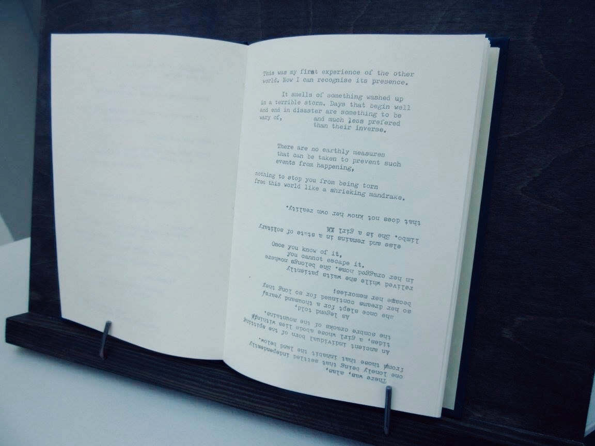
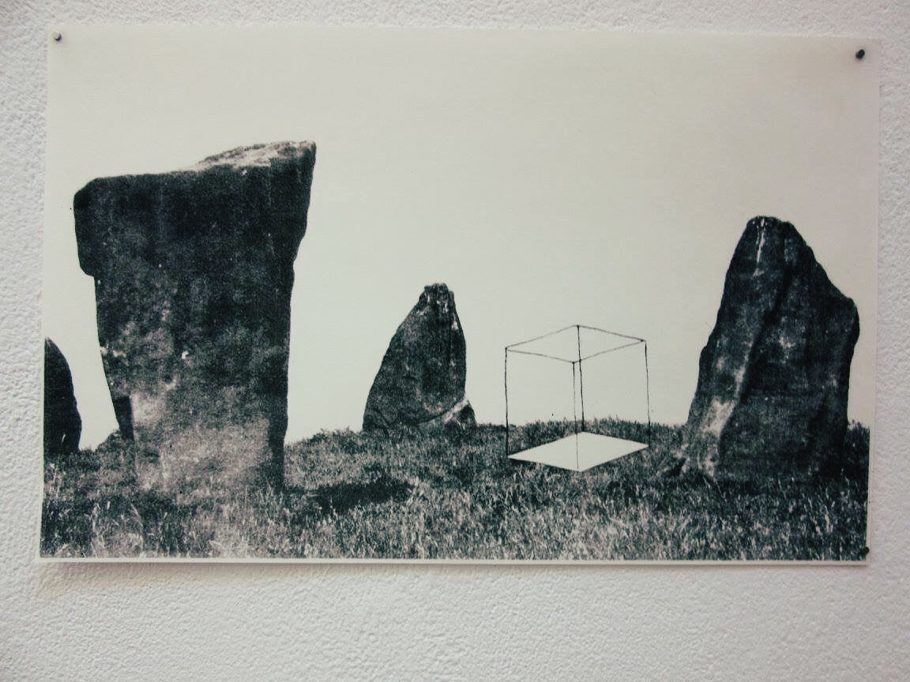
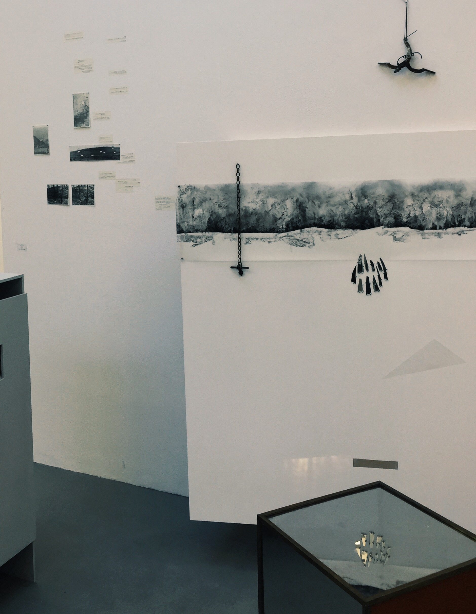
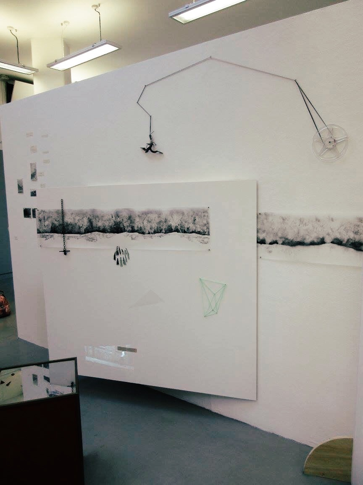

## triangle (symbol)

Many pieces of cross disciplinary fiction seek to recombine media into new and interesting forms. They attend, as this book has illustrated, to each platform in accordance with it's particular strengths, operating at strength when considering the whole in parallel with the individual. Some of them work and some of them falter, sometimes through no fault of their own. Sometimes the story is not strong enough, or the platform well enough considered. Sometimes, though, it is necessary to run as far from digital platforms as we can, in order to see what we're missing, and what they're actually capable of.

Alyssia White's (triangle) explores a relationship between two unnamed narrators as each’s monologue describes an interior journey through a strange, psychologically inflected landscape. Each voice is represented as a typewritten narrative, one running from top to middle and it’s companion 180 degrees inverted on the same page, and deliberately occulting into the space occupied by each’s opposite.

The book runs for seventeen such pages, then gives way to a sequence of images. These contain a framework cuboid shape interspersed into a landscape, a map, a series of film stills and a single image in which the cuboid acts as a portal from one world to another.

No conclusion is provided. The book-as-object defies the need for closure, instead asking to be turned and read upside down, or proposing that the order in which material is presented might not actually be that in which it should be read. This difficulty is compounded when a reader learns that (triangle) is an edition of a work which found it’s original form (in exhibition, repeated) as an assemblage of fragmentary collage, text, found materials and video projected through a series of mirrored surfaces assembled into a cuboid shape equivalent to that represented in the book edition.

White denies there is any clear transposition of form from the original book (the text predates the imagery and video material), instead asserting that the book is an edition of the larger work, compressed from multiple media into a series of pages. She points instead to the juxtaposition of fore and background in the installed edition, asking the viewer to read the work (as one might read line length, a page, a chapter structure) as a combination of visual and written cues, analogous (in this author’s opinion) to decoding a typographically complex piece of design. As can be seen in this photograph of the installed edition, details including the reflected mirror fragments reading as black as installed, and reflecting only within a second surface suggest a richness of design decisions taken within the experience that only arise when rigorous principles are in operation. This is not a random set of objects, nor a hurriedly juxtaposed assemblage.

(triangle) then, works to deny a clear, definitive reading. In that it has a textual core, a textual reading is possible, even preferable, but the work’s editions, constantly-in-flux, situate any reader (even White) as a viewer in media res, never able to gain sufficient distance from the surface of the work to _completely_ understand what they are reading. It is, in short, a work that points to the potential of digital storytelling without ever engaging with digital techniques.

