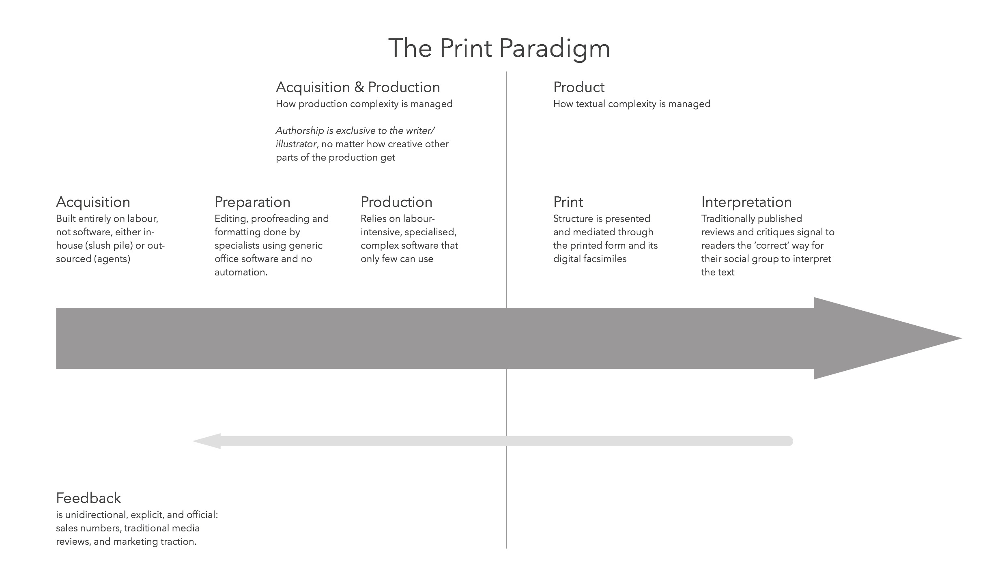

> When, in the development of a natural science, an individual or group
> first produces a synthesis able to attract most of the next
> generation’s practitioners, the older schools gradually disappear. In
> part their disappearance is caused by their members’ conversion to the
> new paradigm. But there are always some men who cling to one or
> another of the older views, and they are simply read out of the
> profession, which thereafter ignores their work. (Thomas S. Kuhn, The
> Structure of Scientific Revolutions)

The Print Paradigm explained the environment of printed media to near
perfection. Stories, books, and articles were written by writers. If
they didn’t have a relationship with a publisher then they had to go
through an acquisition process, their work stacking up in slush piles
and on the desks of agents where they were manually sifted through and
read. Few proceeded to the next step and only few of those who did
proceed built that success into a relationship that let them bypass the
pile on the next go around.

The work was then prepared by skilled professionals—editors,
proofreaders, and the like—all of them using standard office equipment.
First typewriters, then word processors, then computers running word
processing software—and always print manuscripts. Expertise and strategy
lay in hard-earned skill.

Design and typesetting was a highly skilled, labour-intensive process
that required expensive, specialised tools and often a close
collaboration with a printer. Even when desktop typesetting software
appeared in the eighties, they were expensive, complex, and required
specialisation—years of practice—to use.

Print was a capital intensive process—large-scale facilities with big,
expensive machines. Distribution required a nationwide, later global,
network of vehicles and manpower.

Even interpretation and feedback was structured and ordered.
Traditionally published reviews and critiques signalled the ‘proper’
ways to interpret texts and events. Even when the public was heard,
their letters were selected and filtered by the industry before they
were published.

The print paradigm *was* perfect for its set of problems and the era it
dominated.

> To be accepted as a paradigm, a theory must seem better than its
> competitors, but it need not, and in fact never does, explain all the
> facts with which it can be confronted. (Thomas S. Kuhn, The Structure
> of Scientific Revolutions)

If the above is your reality—if this is the world you inhabit—then you
are in serious trouble because the print paradigm is dying. It doesn't provide the speed and responsiveness that your customers demand. It isn't capable of adapting to the problems that you and your customers are facing.

For better or for worse, networked media—the web and apps—now have
primacy over other media. The print worldview is dead. Not the printed book, of
course. The book has been around for centuries and will be here for
centuries to come. What is dead is the print worldview—its
paradigm—because the practices and concepts of the print paradigm are
inadequate to the problems of the networked era.

The print ecosystem and its production processes are in a decline
because they have ceased to help us and instead hinder us in our
practice. Printed matter now exists within a larger media environment
and that new environment requires a theory of practice that encompasses
both print and digital.
