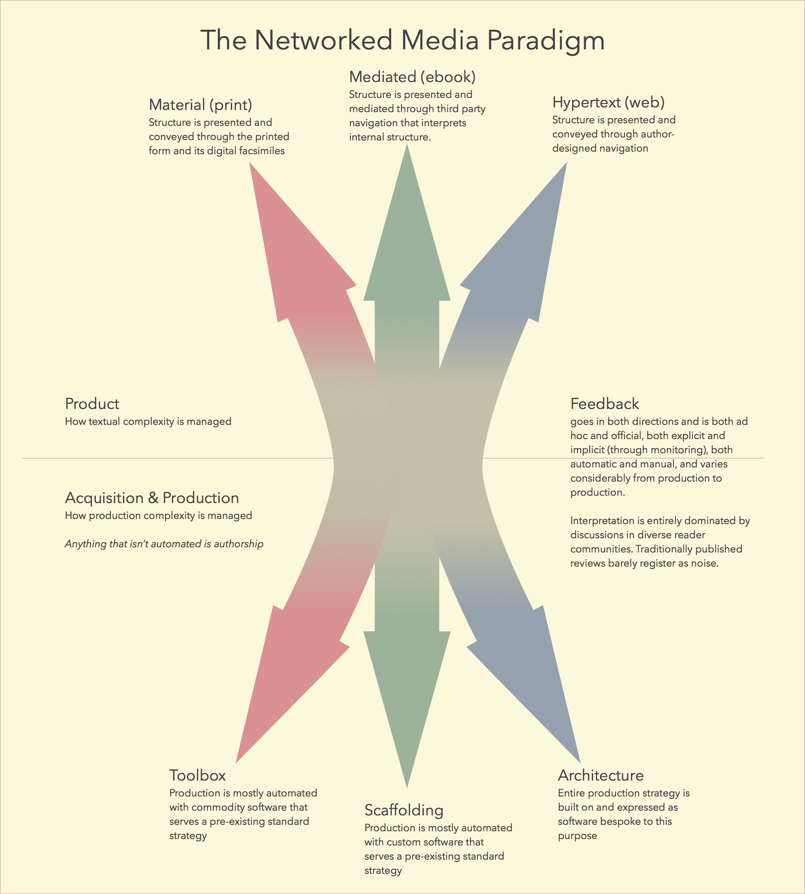

> In the interim, however, during the period when the paradigm is
> successful, the profession will have solved problems that its members
> could scarcely have imagined and would never have undertaken without
> commitment to the paradigm. And at least part of that achievement
> always proves to be permanent. (Thomas S. Kuhn, The Structure of
> Scientific Revolutions)

\[Introduce and explain the diagram\]
